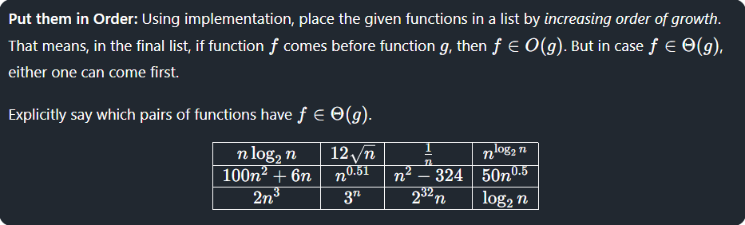

## Problem


## Theory
- **Constant / Decreasing**: `1/n`.
- **Logarithmic**: `log2n`.
- **Sublinear (fractional powers)**: `sqrt(n)`, `n^0.51`.
- **Linearithmic**: `n.log2n`.
- **Linear**: `(2^32)*n` (linear growth with large constant).
- **Polynomial**: `n^2`, `n^3`, etc.
- **Super-polynomial**: `n^(log2n)` (faster than any fixed polynomial).
- **Exponential**: `3^n` (faster than any polynomial).

## Approach
The C program:

- Defines each function in C.
- Evaluates them at a large input (`n = 1000`).
- Sorts based on their computed values.
- Prints them in increasing order.
- At sufficiently large `n`, the ordering stabilizes according to asymptotic growth.


## Final Ordering
```
1/n < 12/sqrt(n) < log2(n) < n^0.51 < 50*sqrt(n) < n*log2(n) < n^2 - 324 < 100*n^2 + 6*n < 2*n^3 < (2^32)*n < n^(log2(n)) < 3^n
```

## Usage
To run the analysis program:
```bash
gcc Code.c
./a.out
```

## Example Output
For `n = 1000`:
```
Sorted by growth (n=1000):
1/n < 12/sqrt(n) < log2(n) < n^0.51 < 50*sqrt(n) < n*log2(n) < n^2 - 324 < 100*n^2 + 6*n < 2*n^3 < (2^32)*n < n^(log2(n)) < 3^n
```